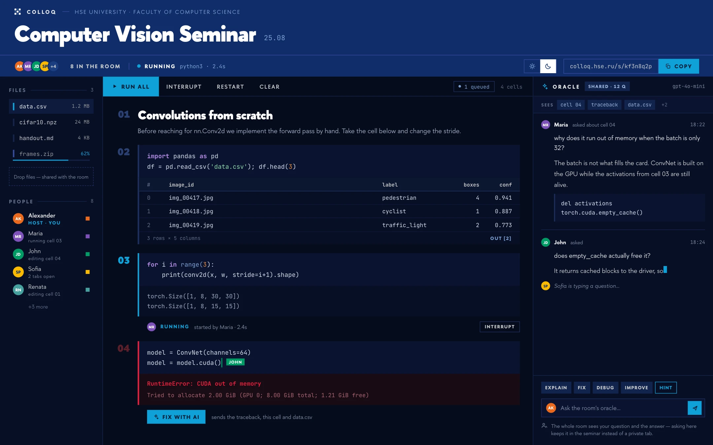

<p align="center">
  
</p>
<h1 align="center">Colloq</h1>
<p align="center">
  <strong>One link. One live notebook. The whole room.</strong><br>
  A self-hosted workspace for teaching Python, data science and machine learning together.
</p>
<p align="center">
  <a href="#start-locally">Quick start</a> ·
  <a href="#teach-your-way">Teaching</a> ·
  <a href="#deploy-for-a-class">Deployment</a> ·
  <a href="https://colloq.ru/docs/">Documentation</a>
</p>

<p align="center">
  
</p>
<p align="center"><sub>The Colloq workspace: shared code, visible participation, and an AI conversation everyone can follow.</sub></p>

A teacher creates a class and shares its link. Students enter their names and
join the same notebook, with the same files and the same Python state. No student
accounts, installation or environment setup. When someone runs a cell, everyone
sees the result.

Colloq is built around the class happening together: a live coding exercise,
a lecture that opens up for questions, or individual attempts the teacher brings
back to the room.

[Read the documentation →](https://colloq.ru/docs/)

## Inside the room

| | What you can do |
| --- | --- |
| **Write together** | Edit Python and Markdown cells live, see who is typing, and work across multiple notebooks. Import and export `.ipynb` files. |
| **Run together** | Use one Python kernel per class. Runs enter a visible queue, outputs reach everyone, and a late arrival sees the notebook as it stands. |
| **Keep the work in view** | Upload datasets, organize folders, edit text files, and preview images and PDFs. The shared terminal works in the room’s filesystem and records who ran each command. |
| **Teach from the page** | Present a PDF with synchronized pages, annotations and a laser pointer. Open a cell to the room or collect individual attempts. |
| **Ask in context** | The Oracle reads the room’s notebook context, including code and outputs. Questions and streamed answers belong to the shared discussion. |
| **Come back after class** | Finish a class to make it read-only for students while preserving its notebook, files and discussion. Resume it with the previous rules intact. |

## Teach your way

The teacher's History panel includes a filtered activity journal alongside
notebook versions: attendance connections, Oracle requests, execution outcomes,
submitted answers and editing participation. Cumulative counts remain available
when the detailed event log is trimmed. See [activity history and statistics](docs/activity-history.md)
for the API, retained data and interpretation limits.

Start with a preset, then adjust the room’s rules before or during the class.
Permissions are enforced by the server.

| Preset | How the class works |
| --- | --- |
| **Lab · Обычный** | Everyone can edit the notebook, run code, upload files and ask the Oracle, subject to the configured limits. |
| **Lecture · Лекция** | The teacher controls editing and execution. Students follow the notebook and can still ask the Oracle when enabled. |
| **Council · Консилиум** | Lecture rules, with an individual sheet for each student when the teacher opens a cell. The teacher reviews attempts and can project one for discussion. |

A cell’s lock can be **closed**, **open to shared editing**, or set to **council**
in any preset. The preset chooses the starting rules; the lock lets a single
exercise change how the room participates.

* **council** — each cell offers teacher-only execution (default), direct student execution, or student requests requiring teacher approval. Requests work for drafts as well as submitted answers; editing the text invalidates the request. The teacher reviews pending requests and approves or declines each one. Approval queues that requested version; it does not submit the answer. All attempts run in the room’s **one kernel**, one after another, so students can use the data the teacher prepared. The server removes names an attempt defines when it finishes; mutation of existing objects and files stays shared. Individual sheets are a teaching tool, not independent execution sandboxes or an isolated grading environment.

<details>
<summary><strong>Room rules and teacher access</strong></summary>

Whatever the card sets, the room can change what opening a cell does; who edits a cell's text; who runs code; who changes the structure; who can put a document on the room's screen; who may create and edit files; whether the Oracle may act on the room's files; actions per request; questions per hour; seconds between questions; who may read the history; who may restart the kernel; and who may wipe shared work. The source of these settings is [rule-rows.ts](web/src/lib/rule-rows.ts).

Whether the oracle answers in this room is chosen on the creation form: **off**, **hints**, or **full**. It is not one of those rows and cannot be changed later in the room settings. Room limits can tighten the instance settings, never loosen them.

Execution and editing permissions need to agree with the exercise. If students
can edit a cell, they can change the source the teacher eventually runs. If they
can execute Python, they can access the room’s files through Python regardless
of restrictions in the Files panel.

The owner manages classes, teachers, environments and Oracle settings at
`/admin`. Teachers sign in through personal links; students join through class
links. Teacher links and the owner’s setup token grant staff access and must stay
private. Adding a teacher does not send an email.

</details>

### Russian or English

The owner opens the globe menu in `/admin` and chooses **Русский** or **English**.
The button shows the current language; the menu marks the selected one. The choice
applies to the whole server: the teaching panel, student rooms, presentation
controls and published material interfaces. Connected rooms switch without a
reload, preserving code, cursor position and form drafts.

Names, teaching materials, code and existing conversations keep their original
text. New Oracle requests use the selected language by default, unless the
question asks for another. The choice is stored in the database. Before an owner
sets it, `UI_LANGUAGE=ru` (default) or `UI_LANGUAGE=en` supplies the initial value.
[Language settings →](https://colloq.ru/docs/language.html)

### An AI the class can follow

The Oracle has two ways to help. **Ask** explains the code, discusses an error,
or proposes an edit for a person to accept. **Do** uses tools to read and edit
files, create notebooks, change and run notebook cells, and run scripts, with a
visible record of its steps. In Do mode, permitted edits apply immediately;
notebook history and file snapshots provide recovery paths. One Do request runs
at a time per class.

Configure your own OpenAI-compatible endpoint and model in the teaching panel
or environment settings. The notebook works without an AI key. When enabled,
selected notebook and file context is sent to the configured provider. Tool use
requires provider support and respects the requesting participant’s room permissions.

**Do mode stops after 24 actions by default.** The owner can change **Actions per
request** in `/admin/oracle`; class rules expose the same setting when creating
or editing a class. Reading, editing and running each consume one action,
including failed attempts. `0` means unlimited; a blank class field inherits the
server setting. A class can tighten a finite server limit. A request also stops
after five minutes of wall-clock work, and when the same call repeats with the
same arguments three times; either way the completed actions stand and the reply
says what was done. Manual Stop remains available. Changes apply to the next request.

## Start locally

For a workstation with **Docker, Docker Compose and Make**, run this from a clone
of the repository:

```bash
make up
```

This builds the app and kernel image, creates `.env` if needed, and starts Colloq
at **http://localhost:3000**. Actual room containers are created on demand.

1. Open `/admin` and claim the instance using the setup token from `data/setup-token` or the initial server log (`make logs`).
2. Create a class and choose its teaching preset and Python environment.
3. For students on other machines, run `make host` to publish an HTTPS address, then copy the class link from the room.

`make host` uses a temporary Cloudflare tunnel by default. Named tunnels, your
own relay, and direct hosting are also available; see [public access](#give-the-room-an-address).
The staff sign-in link printed by the hosting command is separate from the
student class link.

Local Docker mode uses a container per room and grants the development app
access to Docker. It is intended for trusted workstation development. Production
uses the private broker described below. Both paths keep notebooks and uploaded
files across app restarts; restarting a kernel loses its Python variables.

**An environment is a file.** `kernel/environments/<name>.txt` is a pip
requirements list, and three header lines are directives rather than comments:
`# colloq: gpu` claims an exclusive GPU slice for every room on it,
`# colloq: from <name>` builds this image on another environment's image instead
of the base, and `# colloq: python 3.12` chooses the interpreter — 3.10 to 3.13,
defaulting to the `ARG PARENT` version in `kernel/Dockerfile`. pip treats all
three as comments, so they install nothing and do not mark a built image stale.
Only the **root** of a `from` chain decides the Python version: a layer on top
of a built image installs wheels for the interpreter it inherited and cannot
replace it, so a child that asks for a different version is refused by name
before Docker is started. `make env-new NAME=cv PYTHON=3.12` writes the
directive, `make env-list` and `make env-show` print the resolved version, and
the Environments screen shows the version of the **built** image beside its
size — falling back to the version the file asks for, with the usual rebuild
mark, once the two disagree.

### Frontend build modes

Both build modes produce a minified production frontend with lazy screens,
hashed asset URLs and no source maps. The server's development mode does not
turn the built frontend into a development bundle.

| Command | Use |
| --- | --- |
| `npm run dev` | Active development with Vite hot reload. |
| `make run` | Build and run locally, with precompressed frontend assets. |
| `make run FAST=1` | Skip precompression; for the edit-build loop only, since the server then compresses every asset on every request. |
| `npm run build:optimized` | Build all artifacts without starting or restarting the server. |

Precompression adds Brotli quality 11 and gzip level 9 files alongside
JavaScript, CSS and the PDF worker. The server selects an accepted encoding at
the original URL and sends the stored bytes, avoiding compression work on each
download. Unsupported clients and `FAST=1` builds use the original delivery
path, where the server compresses each asset per request: 11.6 ms of CPU and
25 KB more on the wire for the largest chunk, once per student. `make host`
warns when it is about to publish a build with no precompressed files.
HTML retains revalidation; hashed assets retain their one-year cache.

Production Docker images and release CI use the precompressed build by default.
It costs extra build time and disk space, not extra JavaScript or dependencies
in the browser. `npm run perf` checks the bundle budgets for either mode.
For complete cold entry through a working notebook, see [the entry benchmark](docs/entry-performance.md).

<details>
<summary><strong>Local settings</strong></summary>

Start with [.env.example](.env.example). `make up` selects the explicit Docker
development backend; the production installer supplies broker configuration.

| Setting | Purpose |
| --- | --- |
| `BIND_ADDR` | Development server / host publication address. Unset means every interface; the example uses `127.0.0.1`. Compose applies it to the host port, keeping its container listener reachable. |
| `PORT` / `PUBLIC_URL` | Local port and the public origin used to generate class links. |
| `OPENAI_API_KEY` / `OPENAI_BASE_URL` / `OPENAI_MODEL` | Oracle credentials, endpoint and model; also configurable in the teaching panel. |
| `SESSION_SECRET` | Signing key. When empty, a persistent key is generated in `DATA_DIR`; preserve it in backups. |
| `KERNEL_ENV` | Default Python environment for the Docker development backend. |
| `MAX_UPLOAD_MB` / `MAX_SESSION_MB` | Application upload limits; these do not limit arbitrary writes from Python. |

</details>

## Deploy for a class

Production runs on **one Linux amd64 VM with k3s/containerd**. A non-root web app
calls a private runtime broker, which creates a separate Jupyter Pod, token and
workspace mount for each class. The app has no Docker socket or Kubernetes
credentials. If a room’s runtime cannot start, execution fails; there is no
fallback to an instance-wide kernel.

Use an explicitly published release and its matching deployment bundle. From the
extracted bundle, with your configuration in `instance.env`:

```bash
python3 scripts/release.py validate --release release.json
sudo scripts/cluster.sh install --release release.json --env-file instance.env
sudo scripts/cluster.sh smoke
```

Private images also require `--registry-config /path/to/pull-only-config.json`.
Each release records the `sourceCommit`, image digests, exact tooling versions
and deployment-tool hashes. The installer rejects mismatched tooling. The host
proxy reaches the app at `127.0.0.1:30080`; the broker and Kubernetes API stay private.

**Choose the Python environment once, keep it for the class.** Production
rooms retain their selected image revision when the default changes. Publish
custom packages through a new release/catalog; images are built outside the web
app. GPU environments request one exclusive NVIDIA GPU per room and require a
real CUDA preflight. GPU devices are not implicitly shared between classes.

### Give the room an address

The following Make targets require a full source checkout. The minimal deployment
bundle contains the cluster and recovery tools.

| Route | Command | Requirements |
| --- | --- | --- |
| Temporary tunnel | `make host` | Cloudflare connectivity; the URL changes each run. |
| Named tunnel | `make tunnel-setup HOST=seminar.example.edu`, then `make host HOST=seminar.example.edu` | A configured Cloudflare account and domain. |
| Your own relay | `make relay-setup WHERE=root@your-relay`, then `make host HOST=seminar.example.edu` | A public relay, its domain, and relay settings in `.env`. |
| Direct HTTPS | `sudo make host-direct HOST=seminar.example.edu` | Public Linux host, reachable ports 80/443, and a Cloudflare DNS token; Caddy serves the app. |

Test access from the students’ network before class. Use your own relay or direct
hosting where the Cloudflare tunnel is unreachable. Keep the relay sized for the
connected audience: every room published through it depends on that machine.

Your own relay also mirrors the frontend. `make host` uploads `assets/`,
`fonts/` and `pdf/` from the build to the relay, which serves those paths itself
with the same cache headers the app sends; only the live room still travels
through the tunnel. A missing or stale file falls through to the tunnel, so the
mirror never breaks a class. `curl -sI https://<host>/assets/<file>` reports
`X-Colloq-Mirror: hit` when the relay answered. Previous chunk names stay
available for 30 days, so tabs opened before a deploy still load.

### Keep the work recoverable

Production state lives under `/var/lib/colloq`. Local volumes survive Pod
replacement; losing the VM disk requires an off-machine backup.

```bash
sudo env MODE=consistent scripts/backup.sh
sudo scripts/cluster.sh start
```

A consistent backup stops the app, broker and every room writer; restarting is
explicit and Python memory is lost. A live backup is **not an atomic snapshot**
of the database and workspace. Updates and rollbacks also interrupt active rooms.
Follow the deployment guide for restore, interrupted-operation recovery and
schema-compatible rollback.

| Operator guide | What it covers |
| --- | --- |
| [Single-node deployment](deploy/k3s/README.md) | Releases, installation, environments, storage, updates, rollback and GPU prerequisites. |
| [Vast VM deployment](docs/deployment-vast.md) | Renting a VM, registry credentials, named backups and recovery. Rental and disk destruction require confirmation. |
| [Runtime boundary](runtime/README.md) | Broker API, credentials, room lifecycle and isolation limits. |
| [Deployment verification](docs/deployment-proof-2026-09-09.md) · [Vast GPU results](docs/deployment-vast-gpu-2026-09-09.md) | Recorded execution checks, tested versions and the scope of deployment evidence. |

Isolation is **between classes**. Participants inside a class share Python,
files and a terminal. Containers share the host Linux kernel; standard Kubernetes
NetworkPolicy has a local-node traffic exception. One node provides no high
availability, and PVC capacity is not an enforced per-room disk quota. Review the
[runtime boundary](runtime/README.md) before admitting untrusted workloads.

## Development

Use **Node.js 22**, npm, Docker and Make. For a Linux host with the app running
outside Docker:

```bash
npm ci
make dev
NODE_ENV=development KERNEL_BACKEND=docker npm run dev
```

The server listens on `:3000`; Vite serves the development UI on `:5173` and
proxies API/WebSocket traffic to the server. `make dev` builds the room kernel
image; there is no shared Jupyter service.

Native macOS development additionally requires the deliberate filesystem opt-in:

```bash
COLLOQ_UNSAFE_DEV_FILES=1 NODE_ENV=development KERNEL_BACKEND=docker npm run dev
```

This mode is for trusted local development. Linux production requires secure
filesystem access through `/proc/self/fd` and refuses to start without it.
Leave `WORKSPACE_HOST_DIR` unset when running the app directly on the host.

For a built frontend and a background server, use `make run`. On macOS, first
add `COLLOQ_UNSAFE_DEV_FILES=1` to your local `.env`; this also persists the opt-in
across restarts. Use `make up` to run the server in Linux Docker instead.

```bash
npm run typecheck
npm test
npm run build
```

Tests run without a live server or browser. End-to-end, performance and load
harnesses need a running disposable instance; see [the test guide](tests/README.md)
for setup, authentication and scope. Use the actual test output for counts and timing.

| Directory | Responsibility |
| --- | --- |
| [`web/`](web/) | Svelte 5 UI, CodeMirror editors and Yjs collaboration. |
| [`server/`](server/) | Express API, WebSockets, SQLite persistence, execution queues and AI. |
| [`shared/`](shared/) | Notebook schema, permissions and protocols shared across the application. |
| [`runtime/`](runtime/) | Private broker and fixed Kubernetes room templates. |
| [`kernel/`](kernel/) | Python kernel images and environment definitions. |
| [`deploy/`](deploy/) · [`scripts/`](scripts/) | Release tooling, deployment, hosting and operations. |

The server participates in the Yjs document and writes execution results into
it, so every client receives the same output. Notebook state is periodically
snapshotted to SQLite; graceful shutdown flushes pending changes, while abrupt
power loss can lose the latest edits. Browsers communicate with the app and
never receive Jupyter credentials.

Colloq focuses on the live class. It does not provide an LMS, course progress
tracking, automated grading, SSO or video conferencing. The current interface
supports Russian and English.

---

<p align="center"><a href="LICENSE">MIT licensed</a> · <a href="https://colloq.ru/docs/">Documentation</a></p>
