<p align="center">
  
</p>
<h1 align="center">Colloq</h1>
<p align="center">
  <a href="README.md"></a>
  <a href="README.ru.md"></a>
</p>
<p align="center">
  <strong>One link. One live notebook. The whole room.</strong><br>
  A self-hosted classroom for teaching Python, data science and ML together.
  Students join from a browser with just a name.
</p>
<p align="center">
  <a href="https://github.com/sleep3r/colloq/actions/workflows/ci.yml"></a>
  <a href="LICENSE"></a>
  <a href="CHANGELOG.md"></a>
  <a href="https://colloq.ru/docs/en/"></a>
</p>
<p align="center">
  <a href="#quick-start">Quick start</a> ·
  <a href="#how-a-class-runs">How a class runs</a> ·
  <a href="https://colloq.ru/docs/en/">Documentation</a> ·
  <a href="#contributing">Contributing</a>
</p>

<p align="center"><picture><source media="(prefers-color-scheme: dark)" srcset=".github/assets/readme/room-dark.svg"></picture></p>
<p align="center"><sub>Share one link; the class fills the room and everyone sees where everyone is.</sub></p>

```bash
pip install colloq
colloq start          # a class on this computer, in your browser
colloq start --share  # …and one link to give your students
```

Installing needs **Python 3.9 or newer**; running a class needs
**Node.js 22 or newer** and **Docker** (macOS and Linux; on Windows, WSL 2). The
server, the web app and the room image come with the package, and your classes
live in `~/.colloq`.

**[Documentation](https://colloq.ru/docs/en/)** ·
[Your first class](https://colloq.ru/docs/en/getting-started.html) ·
[Releases](https://github.com/sleep3r/colloq/releases) ·
[From source](#from-source)

## What Colloq is

A teacher creates a class and shares its link. Students type a name, get a mark,
and they are in: the same notebook, the same files and the same running Python
process as everyone else. There are no student accounts, no installs and no
environment setup. When someone runs a cell, everyone sees the result.

Colloq runs on your own machine or server, under the MIT license. It is built for
the class that happens together: a live coding exercise, a lecture that opens up
for questions, or individual attempts the teacher brings back to the room.

- **For teachers:** presets for how the class works, rules the server enforces, a
  lecture console for an iPad and pen, and a council console for reviewing
  individual answers.
- **For students:** a browser is all it takes, and the same link brings you back.
- **For operators:** a laptop for one class, one Linux VM with k3s for a term, or
  a rented GPU box for a deep-learning course.

> **Status:** pre-1.0; the version badge above carries the current one. Colloq
> runs the author's own courses. Before 1.0 a release can still change how
> something works, so read [CHANGELOG.md](CHANGELOG.md) before upgrading an
> instance that has classes on it.

## How a class runs

### Seminar: write together, run once

Everyone edits the same cells live and sees who is typing where. Each notebook
has **its own Python kernel**: runs enter a visible queue, outputs reach
everyone, and a variable one student defines is there for the next. A lecture
and a seminar open side by side in one class therefore do not share variables,
and they can be computing at the same time. A late arrival sees the notebook as
it stands. This is the **Standard** preset.

<p align="center"><picture><source media="(prefers-color-scheme: dark)" srcset=".github/assets/readme/run-dark.svg"></picture></p>

### Council: everyone answers, the class discusses one

Open a cell as a council and every student writes on their own sheet; only the
teacher sees the text. The teacher's council console, a separate window, lists the
submitted work and the run queue, sets a time limit for each run, marks each
answer correct or for revision, and shows one answer to the class, **with or
without names**. Attempts share that notebook's one kernel, so council is a teaching tool, not
an isolated grading sandbox ([details below](#presets-and-cell-locks)).

<p align="center"><picture><source media="(prefers-color-scheme: dark)" srcset=".github/assets/readme/council-dark.svg"></picture></p>

### Lecture: a PDF, your pen, every screen

Present a PDF from the **Lecture console**, built for an iPad and a pen: turn
pages, draw, point with the laser. The projector window (`/s/:id/screen`) and
every student's screen follow, and ink lands at the same spot on each of them.
Students can press **Read on my own** to page through by themselves, and **To
lecture** brings them back to the presenter's page.

<p align="center"><picture><source media="(prefers-color-scheme: dark)" srcset=".github/assets/readme/lecture-dark.svg"></picture></p>

### Presets and cell locks

Pick a preset when you create the class, then adjust the room's rules before or
during the class. **Permissions are enforced by the server.**

| Preset | What the class can do |
| --- | --- |
| **Standard** | Everyone edits the notebook, runs cells and adds files. Oracle access follows its settings. |
| **Lecture** | The teacher edits and runs. Students read the notebook, and the teacher can open individual cells for them to work on. |
| **Council** | Lecture rules, but opening a cell gives every student a separate sheet. The teacher reviews the attempts and shows chosen ones to the class. |

The preset sets the starting rules; a cell's lock lets a single exercise change
how the room takes part. In any preset, a cell can be:

* **closed** — the room's rules decide who edits and runs it.
* **open to shared editing** — anyone in the room can edit and run that one cell, even under Lecture rules.
* **council** — each cell runs **Only me** (teacher-only execution, the default), **Everyone in turn** (students run directly) or **On request** (each student run needs the teacher's approval). Requests work for drafts as well as submitted answers; editing the text invalidates the request. Approval queues the requested version; it does not submit the answer. All attempts run in that notebook's **one kernel**, one after another, so students can use the data the teacher prepared. Each attempt gets personal copies of that data — tables, arrays, containers, torch tensors, models and their optimisers, sparse matrices, and objects of classes defined in the notebook — and afterwards the server restores the namespace exactly as it was: it removes the names the attempt defines and undoes its rebindings, so `data = data.dropna()`, `df.drop(..., inplace=True)`, `del df` or `globals().clear()` in one attempt does not reach the next. The same entry also protects the room from the three ways one attempt could end the class for everybody: `exit()` and `quit()` are refused (in a Jupyter kernel they shut the process down and everyone loses their variables), `os._exit()` and `os.abort()` are refused too (they end the kernel process on the spot, without even a traceback to say why), and an attempt's address space is capped (`COUNCIL_MEMORY_GUARD`) so `np.ones((40000, 40000))` fails with `MemoryError` on its own card instead of the OOM killer taking the notebook's kernel. Process state that would otherwise change everyone's results goes back too: random seeds, `sys.stdout`, `sys.path`, `os.environ`, `builtins`, warning filters, numpy and pandas options, matplotlib figures. Everything else stays shared: files on disk, modules the attempt imported, objects of types that cannot be copied and objects above the `COUNCIL_COPY_MB` budget — an attempt is told in its own output which of its variables were left shared, and which threads it left running. A review mark reaches only the answer's author, and the class sees it only on an answer the teacher shows. Individual sheets are a teaching tool, not independent execution sandboxes or an isolated grading environment.

<details>
<summary><strong>Room rules and teacher access</strong></summary>

Whatever the card sets, the room can change what opening a cell does; who edits a cell's text; who runs code; after how many seconds a cell stops itself; whether dangerous commands run at all; who changes the structure; who can put a document on the room's screen; who may create and edit files; whether a student may start their own notebook; whether the Oracle may act on the room's files; actions per request; questions per hour; seconds between questions; who may read the history; who may restart the kernel; and who may wipe shared work. The source of these settings is [rule-rows.ts](web/src/lib/rule-rows.ts).

A room holds several notebooks, and each one also has an access of its own —
**as in the room**, **personal** (its author and the teacher work in it),
**open to everyone**, or **teacher only** — set from the **Access** menu on the
notebook's tab. It overrides editing, running and structure for that notebook
alone; files, the terminal and the shared screen stay shared by the room.
Whether a student may start their own notebook at all is a separate rule, off by
default — the teacher grants the rights, not the student — and an own notebook
is personal from the moment it is created. A personal notebook is the one kind
that also runs in a **separate container**: never the class's GPU, its own
memory cgroup, so a greedy draft cannot pull the OOM killer onto the teacher's
kernel — and its author may restart its kernel and clear its output without
asking.

Whether the oracle answers in this room is chosen on the creation form: **As set for the instance**, **Off**, **Hints only** or **Full answers**. It is not one of those rows and cannot be changed later in the room settings. Room limits can tighten the instance settings, never loosen them.

Execution and editing permissions need to agree with the exercise. If students
can edit a cell, they can change the source the teacher eventually runs. If they
can execute Python, they can access the room's files through Python regardless
of restrictions in the Files panel.

The owner manages classes, teachers, environments and Oracle settings at
`/admin`. Teachers sign in through personal links; students join through class
links. Teacher links and the owner's setup token grant staff access and must stay
private. Adding a teacher does not send an email.

</details>

Guides: [room rules](https://colloq.ru/docs/en/room-rules.html) ·
[council](https://colloq.ru/docs/en/council.html) ·
[lectures](https://colloq.ru/docs/en/lectures.html)

## An AI the class can follow

The Oracle lives in the room's shared thread: the whole room sees each question and
each answer, so one student's question helps the next. It reads the notebook's
context, code and outputs included.

<p align="center"><picture><source media="(prefers-color-scheme: dark)" srcset=".github/assets/readme/oracle-dark.svg"></picture></p>

- **Per class, chosen at creation:** As set for the instance, Off, Hints only, or
  Full answers.
- **Ask** explains code, discusses an error, or, from a cell, proposes an edit that
  shows up in the cell with **Accept** and **Discard**. Whoever accepts it is
  recorded as the author.
- **Act** uses tools: it reads and edits files, creates notebooks, changes and
  runs cells and runs scripts, with a visible record of its steps, and only within
  the permissions of the person who asked. Its edits apply immediately; notebook
  history and file snapshots are the way back. One Act request runs at a time per
  class.
- **Any OpenAI-compatible endpoint and model**, including local models served by
  Ollama or vLLM, set in the teaching panel or the environment. With no provider
  configured, the notebook works and there is no Oracle. When the Oracle is enabled, selected
  notebook and file context is sent to the configured provider.

<details>
<summary><strong>Act mode limits</strong></summary>

**Act mode stops after 24 actions by default.** The owner can change **Actions per
request** in `/admin/oracle`; class rules expose the same setting when creating
or editing a class. Reading, editing and running each consume one action,
including failed attempts. `0` means unlimited; a blank class field inherits the
server setting. A class can tighten a finite server limit. A request also stops
after five minutes of wall-clock work, and when the same call repeats with the
same arguments three times; either way the completed actions stand and the reply
says what was done. Manual Stop remains available. Tool use requires provider
support. Changes apply to the next request.

</details>

Guide: [the Oracle](https://colloq.ru/docs/en/oracle.html)

## Everything else in the room

| Feature | What you get |
| --- | --- |
| **Shared files and terminal** | Upload datasets, organize folders, edit text files, preview images and PDFs. The shared terminal works in the room's filesystem and records who ran each command. |
| **Cell output** | Text, tracebacks, `pandas` tables, Markdown, images and SVG, plus interactive `plotly` figures — drawn in a sandboxed frame with no access to the class and no network of its own. Scripts from a cell's output are never executed: the output is produced by anyone allowed to run code, and it is rendered in every browser in the room. |
| **History** | Notebook versions, plus a filtered activity journal in the teacher's History panel: attendance, Oracle requests, run outcomes, submitted answers and editing participation. See [activity history](docs/activity-history.md). |
| **Notebooks in and out** | Several notebooks per room and `.ipynb` export. Start a class from a `.ipynb` file (outputs are not imported) or from a GitHub link to a notebook or folder in a public repository. |
| **End class, resume later** | **End class** makes the room read-only for students and keeps its notebook, files and discussion. **Resume class** brings back the previous rules. |
| **Courses and published pages** | Publish chosen notebook versions as a read-only page that keeps its link, and group classes on a course page. |
| **Russian or English** | The owner switches the interface for the whole instance from `/admin`. Open rooms switch live, keeping code, cursors and drafts. [Language settings](https://colloq.ru/docs/en/language.html). |
| **Python environments** | An environment is a requirements file; each class picks one at creation. GPU environments give each room an exclusive GPU slice. |

## Competitions

A competition is a task with a closed evaluation: you hand the class the data and
the description, an entrant submits an `.ipynb` notebook as a file, and the server
executes it **from scratch** in a throwaway container with no network, then scores
the result with your metric. It lives next to courses, under **Competitions** in
the admin panel, and the class opens it at an address like `/k/<name>`.

What you set up: a title and an address, a Markdown description, the open data
files, the **hidden answers**, a sample notebook with a baseline solution, the
metric code, the execution limits and a deadline. Until the sample notebook has
gone the whole way to a number, the competition cannot be opened: a task that does
not even solve for its author means a hundred people hunting for a mistake of
their own that isn't there.

How a result is computed. A submission takes two steps in two separate throwaway
containers: first the notebook runs and `submission.csv` is taken out of it, then
your `score(solution, submission)` runs on its own. The metric is computed
**twice** — on the public share of the rows and on the private one. The public
leaderboard is always visible; the final one opens at the deadline. What counts is
the submission the entrant picked; if they picked none, their best public one.

What an entrant sees: their own submissions and only their own, the stages moving
live (accepted → queued → running the notebook → checking the CSV → scoring),
their own traceback verbatim if the notebook failed, and their place. They read
the text of a `ParticipantVisibleError` raised by your metric in full — everything
else it may print is yours alone to see.

An entrant's identity is instance-level, not per room: a person gets an **entry
key** shaped `K7Q-M2X-9FD` and a link carrying it, and the same key brings them
back to their submissions from another device. The key itself is not in the
database: what is stored is its fingerprint and a copy encrypted with the instance
secret. A teacher can issue a new key — the old one stops working that same
second, along with every tab still open on it.

The queue is one per instance, lives in SQLite and survives a server restart. By
default one submission runs at a time, the queue is fair per person (a person's
second submission queues behind everyone else's first), and the teacher can pause
it or kill the run in progress.

Guide: [competitions](https://colloq.ru/docs/en/competitions.html)

## Quick start

### Install with pip

The whole app ships as a Python package: the server, the built web app, the CLI
and the room's Dockerfile, behind one `colloq` command. Python itself only
carries them — the class runs on Node and Docker.

```bash
pip install colloq     # Python 3.9+, into a virtualenv or with pipx
colloq start           # a class on this computer, in your browser
```

The machine needs **Node.js 22 or newer** and **Docker** running. `colloq` finds
Node on its own, including under nvm, fnm, volta and asdf, and says so in words
when it is missing; the first run installs the server's dependencies once, out
loud. Ctrl+C saves the notebook and stops the class.

1. Claim the instance at `/admin` with the token `colloq start` prints — it is
   kept in `~/.colloq/data/setup-token`.
2. Create a class and choose its preset and Python environment.
3. Share the class link, `/s/<id>`, and never a link with `/admin/` in it.

State lives in `~/.colloq`, never inside the package: `.env`, the database,
`workspace/` and the environments you create. Reinstalling or upgrading leaves
all of it alone, and `COLLOQ_HOME` moves it elsewhere. `colloq host`, `status`,
`doctor`, `backup` and `env` cover the rest — `colloq --help` lists them, and
[python/README.md](python/README.md) and [cli/README.md](cli/README.md) explain
them.

<details>
<summary><strong>One link for your students: <code>colloq start --share</code></strong></summary>

`colloq start --share` starts the class, opens a quick Cloudflare tunnel and
prints one block: the link to hand out (`https://….trycloudflare.com/s/<id>`),
or, with no class yet, where to create one. Ctrl+C closes the link together with
the class, and a quick tunnel takes a new address on every start, so the link is
a new one each time. The first `--share` downloads a pinned `cloudflared`,
checked against a pinned SHA-256 before it is ever run and kept in
`~/.colloq/bin` (`COLLOQ_CLOUDFLARED=/path` uses your own,
`COLLOQ_CLOUDFLARED_DOWNLOAD=0` forbids the download). macOS and Linux only; on
Windows, use WSL 2.

**The isolation gate.** A class goes online only when every room's Python runs
in a container of its own. `--share` and `--host` are refused before the start
if kernels are not one container per room, and again before the tunnel unless
Docker answers and the server confirms it. A refusal leaves the class running
locally. What stays true either way: the link is a door, and whoever has it runs
code in a sandbox on this computer. Keep it for your class.

**Cloudflare addresses do not open from Russia.** For students there, publish
through a relay of your own: `colloq start --host <name>` with the `RELAY_*`
lines in `~/.colloq/.env`; from a checkout, `make relay-setup` prepares the
relay ([Give the room an address](#give-the-room-an-address)).

</details>

### From source

You need **Node.js 22 or newer**, npm, **Docker** (running) and Make.

```bash
git clone https://github.com/sleep3r/colloq.git
cd colloq
npm ci
make dev
```

`make dev` builds the room kernel image when it is missing or stale, then runs
the server on `:3000` (with reload) and Vite on `:5173` in this terminal and opens
the browser (`OPEN=0` skips that). The first launch writes a short local `.env`;
every setting is documented in [.env.example](.env.example).

1. Claim the instance at `/admin` with the token from `data/setup-token` or the
   first server log.
2. Create a class and choose its preset and Python environment.
3. Share the class link. To let people outside your machine in, run `make host`
   in a second terminal for a temporary public address; for a permanent one, see
   [Give the room an address](#give-the-room-an-address).

<details>
<summary><strong>More on local runs</strong></summary>

Ctrl+C saves the notebook and stops this local instance's application and
Python kernels. Files, outputs and the database remain; Python variables do not.
Server reloads preserve kernels until the development session ends. `make run`
builds the optimized frontend and runs the server in the background instead
(`make logs-run`, `make stop`); `make up` keeps the app inside Linux Docker and
also needs Docker Compose.

`make host` owns only its tunnel: stopping it leaves the local session running.
Tunnel failure also preserves local work. Publishing a `make dev` session uses
an expiring address and leaves `.env` unchanged. Staff sign-in links and student
class links serve different purposes.

Local kernels use Docker containers and are intended for trusted workstation
use. Production uses the private broker described under
[Deploy for a real class](#deploy-for-a-real-class).

</details>

A checkout also builds the package itself: `make wheel` writes
`python/dist/colloq-*.whl` (after `npm ci`; it needs Python 3 with pip), and
installing that wheel gives exactly what `pip install colloq` gives.

### A rented GPU box on Vast.ai

`colloq-vast` is one ready image for a rented Vast.ai **VM**: the server, the
built web app, the tunnel clients and the kernel build context. Paste one on-start
script into the Vast template, and the machine comes up with a class address and
an owner sign-in link in its log. Each room still gets its own kernel container.
[deploy/vast/README.md](deploy/vast/README.md) covers the template, settings,
backups and building the image (`make vast-image`); read its *What has been
verified* section before relying on it for a class. For stricter isolation on a
Vast VM, use the k3s path in [docs/deployment-vast.md](docs/deployment-vast.md).

## Deploy for a real class

Production runs on **one Linux amd64 VM with k3s/containerd**. A non-root web app
calls a private runtime broker, which creates a separate Jupyter Pod, token and
workspace mount for each class. The app has no Docker socket or Kubernetes
credentials. If a room's runtime cannot start, execution fails; there is no
fallback to an instance-wide kernel.

Use an explicitly published release and its matching deployment bundle. From the
extracted bundle, with your configuration in `instance.env`:

```bash
python3 scripts/release.py validate --release release.json
sudo scripts/cluster.sh install --release release.json --env-file instance.env
sudo scripts/cluster.sh smoke
```

Private images also require `--registry-config /path/to/pull-only-config.json`.
Each release records the `sourceCommit`, image digests, exact tooling versions
and deployment-tool hashes. The installer rejects mismatched tooling. The host
proxy reaches the app at `127.0.0.1:30080`; the broker and Kubernetes API stay
private.

Rooms keep the Python environment image they were created with when the default
changes. Publish custom packages through a new release catalog; images are built
outside the web app. GPU environments request one exclusive NVIDIA GPU per room
and require a real CUDA preflight.

| Operator guide | What it covers |
| --- | --- |
| [Single-node deployment](deploy/k3s/README.md) | Releases, installation, environments, storage, updates, rollback and GPU prerequisites. |
| [Runtime boundary](runtime/README.md) | Broker API, credentials, room lifecycle and isolation limits. |
| [Vast VM with k3s](docs/deployment-vast.md) | Renting a VM, registry credentials, named backups and recovery. Rental and disk destruction require confirmation. |
| [Vast VM with one image](deploy/vast/README.md) | The `colloq-vast` image, its template and on-start script. |
| [Guides at colloq.ru](https://colloq.ru/docs/en/) | Installing, networking, environments, backups and updates, for operators and teachers. |

### Give the room an address

The following Make targets require a full source checkout. The minimal deployment
bundle contains the cluster and recovery tools.

| Route | Command | Requirements |
| --- | --- | --- |
| Temporary tunnel | `make host` | Cloudflare connectivity; the URL changes each run. |
| Named tunnel | `make tunnel-setup HOST=seminar.example.edu`, then `make host HOST=seminar.example.edu` | A configured Cloudflare account and domain. |
| Your own relay | `make relay-setup WHERE=root@your-relay`, then `make host HOST=seminar.example.edu` | A public relay, its domain, and relay settings in `.env`. |
| Direct HTTPS | `sudo make host-direct HOST=seminar.example.edu` | Public Linux host, reachable ports 80/443, and a Cloudflare DNS token; Caddy serves the app. |

From the pip package the first three rows are `colloq start --share` and
`colloq start --host <name>` (or `colloq host <name>` beside a running class),
with the `RELAY_*` lines in `~/.colloq/.env`.

Test access from the students' network before class. Use your own relay or direct
hosting where the Cloudflare tunnel is unreachable — it does not open from
Russia. Keep the relay sized for the connected audience: every room published
through it depends on that machine.

### Keep the work recoverable

Production state lives under `/var/lib/colloq`. Local volumes survive Pod
replacement; losing the VM disk requires an off-machine backup.

```bash
sudo env MODE=consistent scripts/backup.sh
sudo scripts/cluster.sh start
```

A consistent backup stops the app, broker and every room writer; restarting is
explicit and Python memory is lost. A live backup is **not an atomic snapshot**
of the database and workspace. Updates and rollbacks also interrupt active rooms.
Follow the deployment guide for restore, interrupted-operation recovery and
schema-compatible rollback.

<details>
<summary><strong>Operator notes</strong></summary>

#### An environment is a file

`kernel/environments/<name>.txt` is a pip requirements list, and three header
lines are directives rather than comments: `# colloq: gpu` claims an exclusive GPU
slice for every room on it, `# colloq: from <name>` builds this image on another
environment's image instead of the base, and `# colloq: python 3.12` chooses the
interpreter — 3.10 to 3.13, defaulting to the `ARG PARENT` version in
`kernel/Dockerfile`. pip treats all three as comments, so they install nothing and
do not mark a built image stale. Only the **root** of a `from` chain decides the
Python version: a layer on top of a built image installs wheels for the
interpreter it inherited and cannot replace it, so a child that asks for a
different version is refused by name before Docker is started.
`make env-new NAME=cv PYTHON=3.12` writes the directive, `make env-list` and
`make env-show` print the resolved version, and the Environments screen shows the
version of the **built** image beside its size — falling back to the version the
file asks for, with the usual rebuild mark, once the two disagree.

#### Frontend build modes

Both build modes produce a minified production frontend with lazy screens,
hashed asset URLs and no source maps. The server's development mode does not
turn the built frontend into a development bundle.

| Command | Use |
| --- | --- |
| `make dev` / `npm run dev` | Supervised server watcher and Vite hot reload; kernels survive reloads. |
| `make run` | Background server on the optimized build. |
| `make run FAST=1` | Skip precompression for the edit-build loop; use the default for a class. |
| `npm run build:optimized` | Build all artifacts without starting or restarting the server. |

Precompression adds Brotli quality 11 and gzip level 9 files alongside
JavaScript, CSS and the PDF worker. The server selects an accepted encoding at
the original URL and sends the stored bytes, avoiding compression work on each
download. Unsupported clients and `FAST=1` builds use the original delivery
path, where the server compresses each asset per request: 11.6 ms of CPU and
25 KB more on the wire for the largest chunk, once per student. `make host`
warns when it is about to publish a build with no precompressed files.
HTML retains revalidation; hashed assets retain their one-year cache.
Production Docker images and release CI use the precompressed build by default.
`npm run perf` checks the bundle budgets for either mode. For complete cold entry
through a working notebook, see [the entry benchmark](docs/entry-performance.md).

#### The relay mirrors the frontend

Your own relay also serves the frontend. `make host` uploads `assets/`, `fonts/`
and `pdf/` from the build to the relay, which serves those paths itself with the
same cache headers the app sends; only the live room still travels through the
tunnel. A missing or stale file falls through to the tunnel, so the mirror never
breaks a class. `curl -sI https://<host>/assets/<file>` reports
`X-Colloq-Mirror: hit` when the relay answered. Previous chunk names stay
available for 30 days, so tabs opened before a deploy still load.

#### Local settings

Start with [.env.example](.env.example). `make up` selects the explicit Docker
development backend; the production installer supplies broker configuration.

| Setting | Purpose |
| --- | --- |
| `BIND_ADDR` | Development server / host publication address. Unset means every interface; the example uses `127.0.0.1`. Compose applies it to the host port, keeping its container listener reachable. |
| `PORT` / `PUBLIC_URL` | Local port and the public origin used to generate class links. |
| `OPENAI_API_KEY` / `OPENAI_BASE_URL` / `OPENAI_MODEL` | Oracle credentials, endpoint and model; also configurable in the teaching panel. |
| `SESSION_SECRET` | Signing key. When empty, a persistent key is generated in `DATA_DIR`; preserve it in backups. |
| `UI_LANGUAGE` | Interface language (`ru`, the default, or `en`) until the owner chooses one in `/admin`. |
| `KERNEL_ENV` | Default Python environment for the Docker development backend. |
| `KERNEL_PIDS` / `KERNEL_ROOM_SUBNET` | Process ceiling of a room container (512 by default) and the subnet of the `colloq-rooms` network (`10.213.0.0/22`). |
| `KERNEL_OWN_MAX` / `KERNEL_OWN_PIDS` | Students' personal notebooks run in a second container per class, one that never receives the class's GPU: how many kernels may live in it at once (40 by default) and its process ceiling (2048, because each kernel is about fifteen threads). Over the first number, a run in a personal notebook is refused in words. |
| `KERNEL_OWN_IDLE_MIN` | Minutes of idling after which one personal notebook's kernel is stopped (30 by default; `0` never stops them). The class keeps running; the notebook is told in the kernel log, and the next Run brings its kernel back. The container goes with the last kernel in it. |
| `COLLOQ_ROOM_NETWORK` | Unset: rooms cannot reach local addresses (LAN, router, the host, cloud metadata), and they refuse to start if that block cannot be installed. `open` lifts the block for a trusted setup; `colloq doctor` then says so. |
| `MAX_UPLOAD_MB` / `MAX_SESSION_MB` | Application upload limits; these do not limit arbitrary writes from Python. |
| `COUNCIL_COPY_MB` | How much memory one council attempt may spend on personal copies of the room's data (512 by default). Anything above the budget stays shared, and the attempt is told so in its own output. Copy-on-write pandas copies cost nothing and are not counted. |
| `COUNCIL_MEMORY_GUARD` | Cap the address space of a council attempt at the container's memory limit minus what is already in use (`1` by default; `0` turns it off). A greedy attempt then fails with `MemoryError` on its own card instead of the OOM killer taking the notebook's kernel and everybody's variables. Skipped automatically where it cannot work: outside Linux, without a cgroup limit, or with CUDA nearby. |
| `COMPETITION_BACKEND` | How competition submissions are executed: `docker` (two throwaway containers per submission — one for the notebook, one for the metric) or `test`, a stand-in runner that never executes a single line of a submitted notebook. Unset means `docker`; `test` requires `NODE_ENV=test`, exactly as `KERNEL_BACKEND` does. The stand-in is what lets the whole product — queue, leaderboard, chosen submission — work on a machine without Docker. Competitions have no broker path: on a k3s deployment the server still needs a Docker daemon of its own to run them. |
| `DATA_HOST_DIR` | The competition directory as the Docker daemon sees it — what `WORKSPACE_HOST_DIR` is to rooms. Leave it unset on a host-native server. Under `make up` the server itself lives in a container, and without this a submission silently receives an empty directory instead of its data. |

</details>

## Security model

Isolation is **between classes**, not inside one: participants in a class share
Python, files and a terminal, and anyone allowed to run code reaches the class's
files through Python whatever the Files panel allows.

Each room's Python runs in a hardened container of its own, on every path and
whether or not the class is published. It runs as uid 1000 with every Linux
capability dropped and no way to regain them, under a process ceiling
(`KERNEL_PIDS`, 512 by default). The room keeps the internet, so pip, datasets
and APIs work; it loses the local network — the LAN, the router, the host
itself, a neighbouring room, cloud metadata. Port 53 is the deliberate
exception, because Docker's resolver forwards from addresses that differ per
machine. A room refuses to start when that block cannot be installed, rather
than opening quietly; `COLLOQ_ROOM_NETWORK=open` lifts it for a trusted machine,
and the server and `colloq doctor` say so out loud.

What the boundary does not do: containers share the host Linux kernel, so this
is not VM isolation; on the Docker-based paths (`colloq start`, `make dev`,
`make up` and the Vast image) the server controls the Docker daemon, which on a
Linux host amounts to root; standard Kubernetes NetworkPolicy has a local-node
traffic exception; one node provides no high availability; and PVC capacity is
not an enforced per-room disk quota. Review the [runtime boundary](runtime/README.md)
before admitting untrusted workloads, and report vulnerabilities privately as
described in [SECURITY.md](SECURITY.md).

## Documentation

The guides at **[colloq.ru/docs](https://colloq.ru/docs/en/)** cover installing,
running a class, room rules, lectures, council, the Oracle, competitions,
environments, publishing, networking, backups and updates, in
[English](https://colloq.ru/docs/en/) and [Russian](https://colloq.ru/docs/).
Operator and developer references live next to the code: [deploy/k3s](deploy/k3s/README.md),
[deploy/vast](deploy/vast/README.md), [runtime](runtime/README.md),
[tests](tests/README.md), [cli](cli/README.md) and [python](python/README.md).
This page in Russian: [README.ru.md](README.ru.md).

## Versions and releases

The version's single source is `"version"` in the root `package.json` (the
badge at the top shows it). The other copies, including
`python/colloq/_version.py`, are kept in step, and `make version` checks that
they agree. Versions are never bumped by hand. Commits on `main` follow
[Conventional Commits](https://www.conventionalcommits.org/), and
[release-please](https://github.com/googleapis/release-please) keeps a release
pull request open that bumps every copy and adds the changelog section. Merging
that pull request tags `vX.Y.Z`, creates the GitHub Release and attaches the pip
wheel; a separate workflow publishes that wheel to PyPI and pushes the images to
GHCR, and the k3s release bundle is started by hand. A running server reports
its version at `/api/health`.

What changed is in [CHANGELOG.md](CHANGELOG.md); how a release is cut is in
[RELEASING.md](RELEASING.md).

## Contributing

Colloq is maintained by one person, and help is welcome: a clear bug report, a
reproduction from a real class, a translation fix or a small, well-tested pull
request all go a long way. For anything larger, such as a new room mode, a new
deployment path or a change to the permission model, open an issue first.

- [CONTRIBUTING.md](CONTRIBUTING.md): setting up a checkout, the checks, the conventions that matter here, and commits and pull requests.
- [CODE_OF_CONDUCT.md](CODE_OF_CONDUCT.md): how we treat each other.
- [SUPPORT.md](SUPPORT.md): where to ask questions.
- [SECURITY.md](SECURITY.md): reporting vulnerabilities privately.
- [Issue templates](.github/ISSUE_TEMPLATE): bug reports and feature requests.

### Development loop

After `npm ci` and `make dev` (see [Quick start](#quick-start)), the server
listens on `:3000`; Vite serves the development UI on `:5173` and proxies
API/WebSocket traffic to the server. `make dev` prepares the room kernel image
when needed; there is no shared Jupyter service. Linux production requires secure
filesystem access through `/proc/self/fd` and refuses to start without it. Leave
`WORKSPACE_HOST_DIR` unset when running the app directly on the host.

```bash
npm run typecheck
npm test
npm run build
```

Tests run without a live server or browser. End-to-end, performance and load
harnesses (`npm run e2e`, `npm run perf`, `make load`) need a running disposable
instance, never a real class; the header of each script in `scripts/` gives its
target and settings. Operations such as releases, the relay,
environments and backups are Make targets: `make help` lists them, with help text
in Russian.

| Directory | Responsibility |
| --- | --- |
| [`web/`](web/) | Svelte 5 UI, CodeMirror 6 editors and Yjs collaboration. |
| [`server/`](server/) | Express API, WebSockets, SQLite persistence, execution queues and the Oracle. |
| [`shared/`](shared/) | Notebook schema, room rules, protocols and UI strings shared by server and web. |
| [`runtime/`](runtime/) | Private broker and fixed Kubernetes room templates. |
| [`kernel/`](kernel/) | Python kernel image and environment definitions. |
| [`cli/`](cli/) | The `colloq` command and the supervisor behind `make dev`. |
| [`python/`](python/) | The pip package that carries the built app and the `colloq` command. |
| [`deploy/`](deploy/) · [`scripts/`](scripts/) | Release tooling, the k3s and Vast deployments, hosting and operations. |
| [`site/`](site/) · [`docs/`](docs/) | The colloq.ru landing page and guides (sources in `docs/pages`, built by `docs/build.py`), plus operator notes in `docs/`. |
| [`tests/`](tests/) | The `node --test` unit suite; its README explains how the run is set up. |

The server participates in the Yjs document and writes execution results into
it, so every client receives the same output. Notebook state is periodically
snapshotted to SQLite; graceful shutdown flushes pending changes, while abrupt
power loss can lose the latest edits. Each class gets its own kernel container
(Docker locally, a Jupyter Pod behind the broker in production). Browsers talk
only to the app and never receive Jupyter credentials.

The animations in this README are generated by `make readme-art`
([scripts/readme-art.mts](scripts/readme-art.mts)).

## What Colloq is not

Colloq focuses on the live class. It is not an LMS: there is no course progress
tracking, automated grading, SSO or video conferencing. Pair it with the call tool
you already use.

---

<p align="center">
  MIT © 2026 Aleksandr Kalashnikov ·
  <a href="https://colloq.ru/docs/en/">Documentation</a> ·
  <a href="https://colloq.ru">colloq.ru</a>
</p>
