<p align="center">
  
</p>
<h1 align="center">Colloq</h1>
<p align="center">
  <a href="README.md"></a>
  <a href="README.ru.md"></a>
</p>
<p align="center">
  <strong>Одна ссылка. Одна живая тетрадь. Вся группа.</strong><br>
  Учебный класс на вашем сервере: Python, анализ данных и ML — вместе.
  Студент входит из браузера, назвав только имя.
</p>
<p align="center">
  <a href="https://github.com/sleep3r/colloq/actions/workflows/ci.yml"></a>
  <a href="LICENSE"></a>
  <a href="CHANGELOG.md"></a>
  <a href="https://colloq.ru/docs/"></a>
</p>
<p align="center">
  <a href="#быстрый-старт">Быстрый старт</a> ·
  <a href="#как-идёт-занятие">Как идёт занятие</a> ·
  <a href="https://colloq.ru/docs/">Документация</a> ·
  <a href="#участие">Участие</a>
</p>

<p align="center"><picture><source media="(prefers-color-scheme: dark)" srcset=".github/assets/readme/room-ru-dark.svg"></picture></p>
<p align="center"><sub>Одна ссылка на всех: группа наполняет комнату, и каждый видит, кто где.</sub></p>

```bash
pip install colloq
colloq start          # занятие на этом компьютере, в вашем браузере
colloq start --share  # …и одна ссылка, которую можно раздать группе
```

Для установки нужен **Python 3.9 или новее**; чтобы провести занятие —
**Node.js 22 или новее** и **Docker** (macOS и Linux; в Windows — через WSL 2).
Сервер, веб-приложение и образ комнаты приезжают вместе с пакетом, а ваши
занятия живут в `~/.colloq`.

**[Документация](https://colloq.ru/docs/)** ·
[Первое занятие](https://colloq.ru/docs/getting-started.html) ·
[Выпуски](https://github.com/sleep3r/colloq/releases) ·
[Из исходников](#из-исходников)

## Что такое Colloq

Преподаватель создаёт занятие и отправляет группе ссылку. Студент вводит имя,
получает свой цвет — и он внутри: та же тетрадь, те же файлы и тот же живой
процесс Python, что и у всех. Ни студенческих учётных записей, ни установки, ни
настройки окружения. Кто-то запускает ячейку — результат видят все.

Colloq работает на вашем компьютере или сервере, под лицензией MIT. Он сделан
для занятия, которое идёт вместе: разбор задачи в коде, лекция, которая в любой
момент превращается в вопросы, отдельные попытки, которые преподаватель потом
возвращает всей группе.

- **Преподавателю:** форматы занятия, правила, которые держит сервер, пульт
  лекции для планшета с пером и пульт консилиума для разбора отдельных ответов.
- **Студенту:** хватит браузера, и та же ссылка приводит обратно.
- **Тому, кто это держит:** ноутбук на одно занятие, одна Linux-машина с k3s на
  семестр или арендованная машина с GPU на курс по глубокому обучению.

> **Статус:** до 1.0 — текущую версию показывает значок вверху. На Colloq идут
> собственные курсы автора. До 1.0 выпуск ещё может изменить поведение, поэтому
> перед обновлением инстанса, на котором есть занятия, читайте
> [CHANGELOG.md](CHANGELOG.md) (англ.).

## Как идёт занятие

### Семинар: пишем вместе, ядро у тетради одно

Все правят одни и те же ячейки вживую и видят, кто где печатает. У каждой
тетради **своё ядро Python**: запуски встают в видимую очередь, вывод доходит до
всех, а переменная, которую завёл один студент, есть и у следующего. Лекция и
семинар, открытые в одном занятии рядом, переменных не делят и могут считать
одновременно. Кто вошёл позже, видит тетрадь такой, какая она сейчас. Это формат
**«Обычный»**.

<p align="center"><picture><source media="(prefers-color-scheme: dark)" srcset=".github/assets/readme/run-ru-dark.svg"></picture></p>

### Консилиум: отвечают все, разбираем одного

Откройте ячейку консилиумом — и каждый студент пишет на своём листе; текст видит
только преподаватель. Пульт консилиума, отдельное окно, показывает сданные
работы и очередь запусков, ставит предел времени на запуск, помечает ответ
верным или на доработку и показывает один ответ классу — **с именем или без**.
Попытки считаются в ядре той же тетради, поэтому консилиум — приём
преподавания, а не изолированная песочница для оценивания
([подробности ниже](#форматы-и-замки-ячеек)).

<p align="center"><picture><source media="(prefers-color-scheme: dark)" srcset=".github/assets/readme/council-ru-dark.svg"></picture></p>

### Лекция: PDF, ваше перо, все экраны

Показывайте PDF с **пульта лекции**, сделанного для планшета и пера: листайте,
пишите от руки, показывайте указкой. Окно проекции (`/s/:id/screen`) и экран
каждого студента следуют за вами, и чернила ложатся в то же место у всех.
Студент может нажать **«Читать самому»** и листать сам, а **«К лекции»**
возвращает его на страницу докладчика.

<p align="center"><picture><source media="(prefers-color-scheme: dark)" srcset=".github/assets/readme/lecture-ru-dark.svg"></picture></p>

### Форматы и замки ячеек

Формат выбирают при создании занятия, а правила комнаты меняют до пары и во
время неё. **Права держит сервер.**

| Формат | Что может группа |
| --- | --- |
| **Обычный** | Все вместе редактируют тетрадь, запускают ячейки и добавляют файлы. Доступ к оракулу зависит от его настроек. |
| **Лекция** | Редактирует и запускает преподаватель. Студенты читают тетрадь, а отдельные ячейки преподаватель открывает им для работы. |
| **Консилиум** | Правила лекции, но открытая ячейка выдаёт каждому студенту свой лист. Преподаватель разбирает попытки и показывает классу выбранные. |

Формат задаёт начальные правила, а замок ячейки позволяет одному упражнению
изменить то, как в нём участвует комната. В любом формате ячейка бывает:

* **закрытой** — кто её правит и запускает, решают правила комнаты.
* **открытой всем вместе** — её правит и запускает любой в комнате, даже по
  правилам лекции.
* **консилиумом** — у каждой такой ячейки свой порядок запуска: **«Только я»**
  (запускает преподаватель, это умолчание), **«Все, по очереди»** (студенты
  запускают сами) или **«По просьбе»** (каждый запуск студента преподаватель
  разрешает). Просить можно и о черновике, и о сданном ответе; правка текста
  просьбу отменяет. Разрешение ставит в очередь ту версию, о которой просили, и
  ответом её не делает. Все попытки идут в **одном ядре** комнаты, одна за
  другой, — чтобы студент мог взять данные, которые приготовил преподаватель.
  Данные каждая попытка получает свои — таблицы, массивы, контейнеры, тензоры
  torch, модели с оптимизаторами, разреженные матрицы, объекты классов из самой
  тетради, — а после сервер возвращает пространство имён в точности к тому, что
  было: снимает заведённые ею имена и отменяет перепривязки, так что
  `data = data.dropna()`, `df.drop(..., inplace=True)`, `del df` и
  `globals().clear()` у одного не доходят до следующего. Тем же входом закрыты
  три способа кончить занятие всем сразу: `exit()` и `quit()` в попытке
  отказывают (в ядре Jupyter они завершают процесс, и переменные теряют все),
  `os._exit()` и `os.abort()` отказывают тоже (они кончают процесс ядра
  мгновенно, даже без трассировки), а адресное пространство попытки ограничено
  (`COUNCIL_MEMORY_GUARD`), так что
  `np.ones((40000, 40000))` падает `MemoryError` на своей карточке, а не зовёт
  OOM-killer на ядро тетради. Возвращается и состояние процесса, которое иначе
  меняет результаты следующим: зерно случайных чисел, `sys.stdout`, `sys.path`,
  `os.environ`, `builtins`, фильтры предупреждений, опции numpy и pandas, фигуры
  matplotlib. Всё остальное остаётся общим: файлы на диске, модули, которые
  попытка импортировала, объекты типов, которые не копируются, и объекты сверх
  бюджета `COUNCIL_COPY_MB` — о последних и об оставленных потоках попытка
  читает в собственном выводе.
  Пометка о проверке доходит только до автора
  ответа, а класс видит её лишь на том ответе, который преподаватель показал.
  Отдельный лист — это приём преподавания, а не независимая песочница исполнения
  и не изолированная среда оценивания.

<details>
<summary><strong>Правила комнаты и доступ преподавателя</strong></summary>

Что бы ни задал формат, комната может поменять: что делает открытие ячейки; кто
печатает в ячейках; кто запускает код; через сколько секунд ячейка
останавливается сама; кто меняет состав тетради; кто показывает
документ комнате; кто создаёт и редактирует файлы; может ли студент завести
свою тетрадь; правит ли оракул файлы комнаты сам; сколько
действий у одного запроса; сколько вопросов в час; какой промежуток между
вопросами; кто смотрит ленту версий; кто перезапускает ядро; и кто очищает общие
результаты. Источник этих настроек — [rule-rows.ts](web/src/lib/rule-rows.ts).

Тетрадей в комнате несколько, и у каждой есть свой доступ — **как в комнате**,
**личная** (работают автор и преподаватель), **открыта всем** или **только
преподаватель**. Его меняют в меню **«Доступ»** на вкладке тетради; он
перекрывает правку, запуск и состав ровно в этой тетради, а файлы, терминал и
общий экран остаются общими для комнаты. Может ли студент завести свою тетрадь
вообще — отдельное правило, по умолчанию выключенное: права раздаёт
преподаватель, а не студент себе сам; заведённая своя тетрадь личная сразу.
Личная тетрадь — единственная, которая считается ещё и в **отдельном
контейнере**: GPU занятия ей не даётся, память у неё своя, так что жадный
черновик не зовёт OOM-killer на ядро преподавателя, — а перезапустить её ядро и
стереть её вывод автор может сам.

Отвечает ли оракул в этой комнате, выбирают на форме создания: **«Как настроено
для инстанса»**, **«Выключен»**, **«Только подсказки»** или **«Полные ответы»**.
Среди тех строк, что комната правит у себя, его нет, и позже в настройках
комнаты его не поменять. Ограничения комнаты могут ужесточить настройки
инстанса, но не ослабить их.

Права на запуск и на редактирование должны сходиться с упражнением. Если студент
правит ячейку, он меняет тот текст, который преподаватель в итоге запустит. Если
он может выполнять Python, он доберётся до файлов комнаты через Python, что бы
ни запрещала панель файлов.

Владелец ведёт занятия, преподавателей, окружения и настройки оракула в
`/admin`. Преподаватели входят по личным ссылкам, студенты — по ссылке занятия.
Ссылка преподавателя и токен настройки владельца дают служебный доступ и должны
оставаться личными. Добавление преподавателя не отправляет письма.

</details>

Руководства: [правила комнаты](https://colloq.ru/docs/room-rules.html) ·
[консилиум](https://colloq.ru/docs/council.html) ·
[лекции](https://colloq.ru/docs/lectures.html)

## ИИ, за которым успевает вся группа

Оракул живёт в общей ленте комнаты: вопрос и ответ видит вся группа, поэтому
вопрос одного помогает следующему. Он читает контекст тетради — вместе с кодом и
выводом.

<p align="center"><picture><source media="(prefers-color-scheme: dark)" srcset=".github/assets/readme/oracle-ru-dark.svg"></picture></p>

- **На занятие, выбирается при создании:** «Как настроено для инстанса»,
  «Выключен», «Только подсказки» или «Полные ответы».
- **«Спросить»** объясняет код, разбирает ошибку, а из ячейки предлагает правку —
  она появляется в самой ячейке с кнопками **«Принять»** и **«Отклонить»**.
  Автором записывается тот, кто принял.
- **«Сделать»** пользуется инструментами: читает и правит файлы, создаёт тетради,
  меняет и запускает ячейки, запускает скрипты — с видимой записью шагов и
  только в пределах прав того, кто попросил. Правки применяются сразу; дорога
  назад — история тетради и снимки файлов. Один запрос «Сделать» на занятие
  одновременно.
- **Любая конечная точка и модель, совместимые с OpenAI**, включая локальные
  модели за Ollama или vLLM: задаются в панели преподавателя или в окружении.
  Без настроенного провайдера тетрадь работает, а оракула просто нет. Когда
  оракул включён, выбранный контекст тетради и файлов уходит настроенному
  провайдеру.

<details>
<summary><strong>Пределы режима «Сделать»</strong></summary>

**Режим «Сделать» по умолчанию останавливается после 24 действий.** Владелец
меняет **«Действий на запрос»** в `/admin/oracle`; правила занятия открывают ту
же настройку при создании и правке занятия. Чтение, правка и запуск — по
действию каждое, включая неудачные попытки. `0` — без лимита; пустое поле у
занятия наследует настройку сервера. Занятие может ужесточить конечный предел
сервера, но не ослабить. Запрос останавливается и после пяти минут работы по
часам, и когда один и тот же вызов с теми же аргументами повторяется трижды; в
обоих случаях сделанное остаётся, а ответ говорит, что успели сделать. Кнопка
«Стоп» доступна всегда. Инструменты требуют поддержки со стороны провайдера.
Изменения применяются со следующего запроса.

</details>

Руководство: [оракул](https://colloq.ru/docs/oracle.html)

## Всё остальное в комнате

| Возможность | Что вы получаете |
| --- | --- |
| **Общие файлы и терминал** | Загружайте наборы данных, раскладывайте папки, правьте текстовые файлы, смотрите картинки и PDF. Общий терминал работает в файловой системе комнаты и записывает, кто какую команду выполнил. |
| **Вывод ячейки** | Текст, трейсбеки, таблицы `pandas`, Markdown, картинки и SVG, а ещё интерактивные графики `plotly` — они рисуются в отдельной песочнице без доступа к занятию и без своей сети. Скрипты из вывода ячейки не исполняются никогда: вывод формирует любой, кому разрешён запуск, а показывается он в браузере у всей комнаты. |
| **История** | Версии тетради и отобранная лента активности в панели «История» у преподавателя: посещаемость, запросы к оракулу, исходы запусков, сданные ответы и участие в правках. См. [историю активности](docs/activity-history.md) (англ.). |
| **Тетради туда и обратно** | Несколько тетрадей в комнате и выгрузка `.ipynb`. Занятие можно начать с файла `.ipynb` (вывод не импортируется) или со ссылки на тетрадь или папку в публичном репозитории GitHub. |
| **Закончить занятие и продолжить потом** | **«Закончить занятие»** оставляет комнату студентам только для чтения и сохраняет тетрадь, файлы и обсуждение. **«Продолжить занятие»** возвращает прежние правила. |
| **Курсы и публикации** | Публикуйте выбранные версии тетради страницей для чтения с постоянной ссылкой и собирайте занятия на странице курса. |
| **Русский или английский** | Владелец переключает интерфейс всего инстанса из `/admin`. Открытые комнаты переключаются вживую, сохраняя код, курсоры и черновики. [Настройки языка](https://colloq.ru/docs/language.html). |
| **Окружения Python** | Окружение — это файл требований; занятие выбирает своё при создании. Окружения с GPU дают каждой комнате отдельный кусок GPU. |

## Быстрый старт

### Установка через pip

Всё приложение приезжает пакетом Python: сервер, собранный веб-интерфейс, CLI и
Dockerfile ядра — за одной командой `colloq`. Сам Python их только перевозит:
занятие работает на Node и Docker.

```bash
pip install colloq     # Python 3.9+, в виртуальное окружение или через pipx
colloq start           # занятие на этом компьютере, в вашем браузере
```

Машине нужны **Node.js 22 или новее** и запущенный **Docker**. `colloq` сам
находит Node, в том числе под nvm, fnm, volta и asdf, а если его нет — говорит
об этом словами; на первом запуске он один раз ставит зависимости сервера и
сообщает об этом вслух. Ctrl+C сохраняет тетрадь и заканчивает занятие.

1. Станьте владельцем инстанса на `/admin`: токен печатает `colloq start`, и он
   же лежит в `~/.colloq/data/setup-token`.
2. Создайте занятие, выберите формат и окружение Python.
3. Отправьте группе ссылку занятия, `/s/<id>`, и никогда — ссылку с `/admin/`.

Состояние живёт в `~/.colloq`, а не внутри пакета: `.env`, база данных,
`workspace/` и окружения, которые вы завели. Переустановка и обновление их не
трогают, а `COLLOQ_HOME` переносит всё в другое место. Остальное закрывают
`colloq host`, `status`, `doctor`, `backup` и `env` — список у `colloq --help`,
подробности в [python/README.md](python/README.md) и
[cli/README.md](cli/README.md) (англ.).

<details>
<summary><strong>Одна ссылка для группы: <code>colloq start --share</code></strong></summary>

`colloq start --share` поднимает занятие, открывает быстрый туннель Cloudflare и
печатает один блок: ссылку, которую можно раздать
(`https://….trycloudflare.com/s/<id>`) — или, если занятия ещё нет, куда пойти
его создать. Ctrl+C закрывает ссылку вместе с занятием, а быстрый туннель берёт
новый адрес на каждом запуске, поэтому ссылка каждый раз новая. Первый `--share`
скачивает закреплённый `cloudflared`, сверяет его с закреплённой суммой SHA-256
до первого запуска и кладёт в `~/.colloq/bin` (`COLLOQ_CLOUDFLARED=/path` — взять
свой, `COLLOQ_CLOUDFLARED_DOWNLOAD=0` — запретить скачивание). Только macOS и
Linux; в Windows — через WSL 2.

**Гейт изоляции.** Занятие выходит наружу, только если Python каждой комнаты
работает в своём контейнере. `--share` и `--host` отклоняются до старта, если
ядра идут не по контейнеру на комнату, и ещё раз перед туннелем — пока Docker не
ответит, а сервер не подтвердит это. Отказ оставляет занятие работать локально.
Что верно в любом случае: ссылка — это дверь, и тот, у кого она есть, выполняет
код в песочнице на этом компьютере. Держите её для своей группы.

**Адреса Cloudflare из России не открываются.** Для студентов оттуда публикуйте
через свой ретранслятор: `colloq start --host <имя>` со строками `RELAY_*` в
`~/.colloq/.env`; из исходников ретранслятор готовит `make relay-setup`
([Дайте комнате адрес](#дайте-комнате-адрес)).

</details>

### Из исходников

Нужны **Node.js 22 или новее**, npm, запущенный **Docker** и Make.

```bash
git clone https://github.com/sleep3r/colloq.git
cd colloq
npm ci
make dev
```

`make dev` собирает образ ядра комнаты, если его нет или он устарел, затем
поднимает в этом терминале сервер на `:3000` (с перезагрузкой) и Vite на `:5173`
и открывает браузер (`OPEN=0` это пропускает). Первый запуск пишет короткий
локальный `.env`; все настройки описаны в [.env.example](.env.example) (англ.).

1. Станьте владельцем инстанса на `/admin` с токеном из `data/setup-token` или
   из первых строк журнала сервера.
2. Создайте занятие, выберите формат и окружение Python.
3. Отправьте группе ссылку занятия. Чтобы внутрь попали люди не с вашей машины,
   запустите `make host` во втором терминале — это временный публичный адрес; о
   постоянном — [Дайте комнате адрес](#дайте-комнате-адрес).

<details>
<summary><strong>Подробнее о локальных запусках</strong></summary>

Ctrl+C сохраняет тетрадь и останавливает приложение и ядра Python этого
локального инстанса. Файлы, вывод и база остаются; переменные Python — нет.
Перезагрузки сервера сохраняют ядра до конца сеанса разработки. `make run`
собирает оптимизированный фронтенд и поднимает сервер в фоне (`make logs-run`,
`make stop`); `make up` держит приложение внутри Linux-Docker и дополнительно
требует Docker Compose.

`make host` владеет только своим туннелем: его остановка не останавливает
локальный сеанс. Сбой туннеля тоже сохраняет локальную работу. Публикация сеанса
`make dev` берёт временный адрес и не трогает `.env`. Служебные ссылки для входа
и ссылки занятия для студентов нужны для разного.

Локальные ядра работают в контейнерах Docker и рассчитаны на доверенное рабочее
место. В проде — приватный брокер, о нём в разделе
[Установка для настоящего курса](#установка-для-настоящего-курса).

</details>

Из исходников собирается и сам пакет: `make wheel` пишет
`python/dist/colloq-*.whl` (после `npm ci`; нужен Python 3 с pip), и установка
этого колеса даёт ровно то же, что `pip install colloq`.

### Арендованная машина с GPU на Vast.ai

`colloq-vast` — один готовый образ для арендованной **виртуальной машины**
Vast.ai: сервер, собранный веб-интерфейс, клиенты туннеля и контекст сборки
ядра. Вставьте один скрипт on-start в шаблон Vast — и машина поднимется с
адресом занятия и ссылкой входа владельца в журнале. Каждая комната по-прежнему
получает свой контейнер ядра. [deploy/vast/README.md](deploy/vast/README.md)
(англ.) описывает шаблон, настройки, резервные копии и сборку образа
(`make vast-image`); раздел *What has been verified* прочтите до того, как
доверить образу настоящее занятие. Для более строгой изоляции на машине Vast
есть путь через k3s: [docs/deployment-vast.md](docs/deployment-vast.md) (англ.).

## Установка для настоящего курса

Прод работает на **одной Linux-машине amd64 с k3s/containerd**. Веб-приложение
идёт не от root и обращается к приватному брокеру среды выполнения, а тот заводит
каждому занятию отдельный под Jupyter, токен и монтирование рабочей папки. У
приложения нет ни сокета Docker, ни ключей Kubernetes. Если среда комнаты не
поднялась, исполнение не работает: отката на общее ядро инстанса нет.

Берите явно опубликованный выпуск и подходящий ему комплект развёртывания. Из
распакованного комплекта, со своими настройками в `instance.env`:

```bash
python3 scripts/release.py validate --release release.json
sudo scripts/cluster.sh install --release release.json --env-file instance.env
sudo scripts/cluster.sh smoke
```

Приватным образам нужен ещё `--registry-config /path/to/pull-only-config.json`.
Каждый выпуск записывает `sourceCommit`, дайджесты образов, точные версии
инструментов и хеши средств развёртывания. При несовпадении инструментов
установщик отказывается ставить. Хозяйский прокси доходит до приложения по
`127.0.0.1:30080`; брокер и API Kubernetes наружу не выходят.

Комнаты остаются на том образе окружения Python, с которым были созданы, даже
если умолчание изменилось. Свои пакеты публикуйте новым каталогом выпуска;
образы собираются вне веб-приложения. Окружения с GPU просят по одному
эксклюзивному NVIDIA GPU на комнату и требуют настоящей проверки CUDA.

| Руководство оператора | О чём оно |
| --- | --- |
| [Установка на один узел](deploy/k3s/README.md) (англ.) | Выпуски, установка, окружения, хранилище, обновления, откат и требования к GPU. |
| [Граница среды выполнения](runtime/README.md) (англ.) | API брокера, ключи, жизнь комнаты и пределы изоляции. |
| [Машина Vast с k3s](docs/deployment-vast.md) (англ.) | Аренда машины, ключи реестра, именованные резервные копии и восстановление. Аренда и уничтожение диска требуют подтверждения. |
| [Машина Vast одним образом](deploy/vast/README.md) (англ.) | Образ `colloq-vast`, его шаблон и скрипт on-start. |
| [Руководства на colloq.ru](https://colloq.ru/docs/) | Установка, сеть, окружения, резервные копии и обновления — оператору и преподавателю. |

### Дайте комнате адрес

Перечисленные цели Make требуют полного исходного дерева. В минимальном
комплекте развёртывания есть средства кластера и восстановления.

| Путь | Команда | Что нужно |
| --- | --- | --- |
| Временный туннель | `make host` | Связь с Cloudflare; адрес меняется на каждом запуске. |
| Именованный туннель | `make tunnel-setup HOST=seminar.example.edu`, затем `make host HOST=seminar.example.edu` | Настроенные учётная запись и домен в Cloudflare. |
| Свой ретранслятор | `make relay-setup WHERE=root@your-relay`, затем `make host HOST=seminar.example.edu` | Публичный ретранслятор, его домен и настройки ретранслятора в `.env`. |
| Прямой HTTPS | `sudo make host-direct HOST=seminar.example.edu` | Публичная Linux-машина, доступные порты 80/443 и токен Cloudflare для DNS; приложение отдаёт Caddy. |

Из пакета pip первые три строки — это `colloq start --share` и
`colloq start --host <имя>` (или `colloq host <имя>` рядом с запущенным
занятием) со строками `RELAY_*` в `~/.colloq/.env`.

Проверьте доступ из сети студентов до начала пары. Там, где туннель Cloudflare
недостижим — а из России он не открывается, — берите свой ретранслятор или
прямой хостинг. Держите ретранслятор по размеру аудитории: каждая
опубликованная через него комната зависит от этой машины.

### Чтобы работу можно было вернуть

Состояние прода лежит в `/var/lib/colloq`. Локальные тома переживают замену
пода; потеря диска машины требует резервной копии вне её.

```bash
sudo env MODE=consistent scripts/backup.sh
sudo scripts/cluster.sh start
```

Согласованная копия останавливает приложение, брокер и всех, кто пишет в
комнатах; обратный запуск — отдельное действие, память Python при этом теряется.
Живая копия — **не атомарный снимок** базы и рабочей папки. Обновления и откаты
тоже прерывают активные комнаты. О восстановлении, о прерванной операции и об
откате в пределах совместимой схемы — в руководстве по развёртыванию.

<details>
<summary><strong>Заметки оператора</strong></summary>

#### Окружение — это файл

`kernel/environments/<имя>.txt` — список требований pip, и три строки заголовка в
нём не комментарии, а директивы: `# colloq: gpu` требует эксклюзивный кусок GPU
каждой комнате на этом окружении, `# colloq: from <имя>` собирает этот образ
поверх образа другого окружения, а не поверх базового, а `# colloq: python 3.12`
выбирает интерпретатор — от 3.10 до 3.13, по умолчанию версию из `ARG PARENT` в
`kernel/Dockerfile`. Для pip все три — комментарии: они ничего не ставят и не
помечают собранный образ устаревшим. Версию Python решает только **корень**
цепочки `from`: слой поверх собранного образа ставит колёса для унаследованного
интерпретатора и заменить его не может, поэтому потомок, попросивший другую
версию, получает отказ по имени ещё до запуска Docker.
`make env-new NAME=cv PYTHON=3.12` пишет директиву, `make env-list` и
`make env-show` печатают разрешённую версию, а экран «Окружения» показывает
версию **собранного** образа рядом с его размером — и откатывается к версии,
которую просит файл, с обычной пометкой о пересборке, когда эти две разошлись.

#### Режимы сборки фронтенда

Оба режима дают минифицированный продовый фронтенд с ленивой загрузкой экранов,
хешированными адресами файлов и без карт исходников. Режим разработки у сервера
не превращает собранный фронтенд в сборку для разработки.

| Команда | Когда |
| --- | --- |
| `make dev` / `npm run dev` | Присмотр за сервером и горячая перезагрузка Vite; ядра переживают перезагрузки. |
| `make run` | Сервер в фоне на оптимизированной сборке. |
| `make run FAST=1` | Без предварительного сжатия, для цикла «правка — сборка»; на занятие берите обычный. |
| `npm run build:optimized` | Собрать всё, не поднимая и не перезапуская сервер. |

Предварительное сжатие кладёт рядом с JavaScript, CSS и воркером PDF файлы
Brotli качества 11 и gzip уровня 9. Сервер выбирает принятую кодировку по тому
же адресу и отдаёт сохранённые байты, не тратя работу на каждое скачивание.
Клиенты без поддержки и сборки с `FAST=1` идут прежним путём, где сервер жмёт
каждый файл на каждый запрос: 11,6 мс процессора и лишние 25 КБ в сети на самом
большом куске — по разу на студента. `make host` предупреждает, когда собирается
опубликовать сборку без предсжатых файлов. У HTML остаётся перепроверка, у
хешированных файлов — кеш на год. Продовые образы Docker и CI выпусков по
умолчанию берут предсжатую сборку. `npm run perf` проверяет бюджеты бандла для
обоих режимов. О полном холодном входе до работающей тетради —
[замер входа](docs/entry-performance.md) (англ.).

#### Ретранслятор зеркалит фронтенд

Ваш ретранслятор ещё и раздаёт фронтенд. `make host` заливает на него `assets/`,
`fonts/` и `pdf/` из сборки, и эти пути он отдаёт сам, с теми же заголовками
кеша, что шлёт приложение; через туннель едет только живая комната. Недостающий
или устаревший файл проваливается в туннель, поэтому зеркало не ломает занятие.
`curl -sI https://<host>/assets/<file>` отвечает `X-Colloq-Mirror: hit`, когда
ответил ретранслятор. Прежние имена кусков остаются доступными 30 дней, так что
вкладки, открытые до выкладки, загружаются.

#### Локальные настройки

Начните с [.env.example](.env.example) (англ.). `make up` выбирает явный
docker-бэкенд для разработки; в проде настройки брокера даёт установщик.

| Настройка | Зачем |
| --- | --- |
| `BIND_ADDR` | Адрес сервера разработки и публикации. Пусто — все интерфейсы; в примере стоит `127.0.0.1`. Compose применяет её к хозяйской стороне порта, оставляя слушателя внутри контейнера доступным. |
| `PORT` / `PUBLIC_URL` | Локальный порт и публичный источник, из которого собираются ссылки занятий. |
| `OPENAI_API_KEY` / `OPENAI_BASE_URL` / `OPENAI_MODEL` | Ключ, адрес и модель оракула; настраиваются и в панели преподавателя. |
| `SESSION_SECRET` | Ключ подписи. Пустой — постоянный ключ создаётся в `DATA_DIR`; сохраняйте его в резервных копиях. |
| `UI_LANGUAGE` | Язык интерфейса (`ru` по умолчанию или `en`), пока владелец не выбрал его в `/admin`. |
| `KERNEL_ENV` | Окружение Python по умолчанию для docker-бэкенда разработки. |
| `KERNEL_PIDS` / `KERNEL_ROOM_SUBNET` | Потолок числа процессов в контейнере комнаты (512 по умолчанию) и подсеть сети `colloq-rooms` (`10.213.0.0/22`). |
| `KERNEL_OWN_MAX` / `KERNEL_OWN_PIDS` | Личные тетради студентов считаются во втором контейнере занятия — том, которому GPU занятия не даётся: сколько ядер может жить в нём одновременно (40 по умолчанию) и его потолок процессов (2048: у каждого ядра около пятнадцати потоков). Сверх первого числа запуск в личной тетради отказывает словами. |
| `KERNEL_OWN_IDLE_MIN` | Через сколько минут простоя гаснет ядро одной личной тетради (30 по умолчанию, `0` — не гасить). Занятие при этом идёт дальше: тетрадь читает об этом в журнале ядра, а следующий Run поднимает ядро заново. Контейнер уходит с последним ядром в нём. |
| `COLLOQ_ROOM_NETWORK` | Пусто: комнаты не достают до локальных адресов (локальная сеть, роутер, сам компьютер, метаданные облака) и не поднимаются, если этот запрет не удалось поставить. `open` снимает запрет на доверенной машине; `colloq doctor` тогда говорит об этом. |
| `MAX_UPLOAD_MB` / `MAX_SESSION_MB` | Пределы загрузки в приложении; произвольную запись из Python они не ограничивают. |
| `COUNCIL_COPY_MB` | Сколько памяти одна попытка консилиума может потратить на личные копии данных комнаты (512 по умолчанию). Что сверх бюджета — остаётся общим, и попытка читает об этом в своём выводе. Ленивые копии pandas (Copy-on-Write) бесплатны и в счёт не идут. |
| `COUNCIL_MEMORY_GUARD` | Ограничивать ли адресное пространство попытки консилиума пределом контейнера за вычетом занятого (`1` по умолчанию, `0` выключает). Жадная попытка тогда падает с `MemoryError` на своей карточке, а не зовёт OOM-killer, который уносит ядро тетради вместе с переменными всех. Там, где это не работает, не ставится само: не Linux, нет предела cgroup, рядом CUDA. |

</details>

## Модель безопасности

Изоляция — **между занятиями**, а не внутри одного: участники занятия делят
Python, файлы и терминал, и всякий, кому разрешён запуск, доберётся до файлов
занятия через Python, что бы ни позволяла панель файлов.

Python каждой комнаты работает в своём укреплённом контейнере — на любом пути и
независимо от того, опубликовано занятие или нет. Он идёт от uid 1000, все
привилегии Linux у него сняты, вернуть их себе он не может, а число процессов
ограничено потолком (`KERNEL_PIDS`, 512 по умолчанию). Интернет у комнаты
остаётся, и pip, наборы данных и внешние API работают; локальной сети у неё нет:
ни домашней или университетской сети, ни роутера, ни самого компьютера, ни
соседней комнаты, ни метаданных облака. Порт 53 оставлен открытым нарочно:
резолвер Docker пересылает запросы с адресов, которые на разных машинах разные.
Если запрет не удалось поставить, комната не поднимается, вместо того чтобы тихо
открыться; `COLLOQ_ROOM_NETWORK=open` снимает его на доверенной машине, и сервер
и `colloq doctor` говорят об этом вслух.

Чего эта граница не делает: контейнеры делят ядро Linux с хозяином, то есть это
не изоляция виртуальной машины; на путях с Docker (`colloq start`, `make dev`,
`make up` и образ Vast) сервер управляет демоном Docker, а это на Linux-машине
равно root; у стандартной NetworkPolicy в Kubernetes есть исключение для
трафика внутри узла; один узел не даёт отказоустойчивости; а размер PVC не
работает как дисковая квота комнаты. Прочтите
[границу среды выполнения](runtime/README.md) (англ.) до того, как впускать
недоверенные нагрузки, и сообщайте об уязвимостях приватно, как описано в
[SECURITY.md](SECURITY.md) (англ.).

## Документация

Руководства на **[colloq.ru/docs](https://colloq.ru/docs/)** рассказывают про
установку, проведение занятия, правила комнаты, лекции, консилиум, оракула,
окружения, публикации, сеть, резервные копии и обновления — по-русски и
[по-английски](https://colloq.ru/docs/en/). Справочники оператора и разработчика
лежат рядом с кодом и написаны по-английски: [deploy/k3s](deploy/k3s/README.md),
[deploy/vast](deploy/vast/README.md), [runtime](runtime/README.md),
[tests](tests/README.md), [cli](cli/README.md) и [python](python/README.md).
Эта же страница по-английски: [README.md](README.md).

## Версии и выпуски

Единственный источник версии — поле `"version"` в корневом `package.json` (его
показывает значок вверху). Остальные копии, включая `python/colloq/_version.py`,
держатся с ним в ногу, а `make version` проверяет, что они сходятся. Версии
никогда не поднимают руками. Коммиты в `main` следуют
[Conventional Commits](https://www.conventionalcommits.org/), а
[release-please](https://github.com/googleapis/release-please) держит открытым
пул-реквест выпуска, который поднимает каждую копию и дописывает раздел журнала
изменений. Слияние этого пул-реквеста ставит тег `vX.Y.Z`, создаёт GitHub
Release и прикладывает колесо pip; отдельный процесс публикует это колесо на
PyPI и отправляет образы в GHCR, а комплект выпуска для k3s запускают руками.
Работающий сервер сообщает свою версию по `/api/health`.

Что изменилось — в [CHANGELOG.md](CHANGELOG.md) (англ.); как режут выпуск — в
[RELEASING.md](RELEASING.md) (англ.).

## Участие

Colloq ведёт один человек, и помощь нужна: внятный отчёт об ошибке,
воспроизведение с настоящего занятия, поправка в переводе или небольшой
пул-реквест с тестами — всё это дорогого стоит. О чём-то большем — новый режим
комнаты, новый путь развёртывания, изменение модели прав — сначала заведите
issue.

- [CONTRIBUTING.md](CONTRIBUTING.md) (англ.): как поднять дерево, какие есть
  проверки, какие здесь приняты соглашения и как устроены коммиты и
  пул-реквесты.
- [CODE_OF_CONDUCT.md](CODE_OF_CONDUCT.md) (англ.): как мы друг с другом.
- [SUPPORT.md](SUPPORT.md) (англ.): куда идти с вопросом.
- [SECURITY.md](SECURITY.md) (англ.): как сообщить об уязвимости приватно.
- [Шаблоны issue](.github/ISSUE_TEMPLATE) (англ.): отчёты об ошибках и
  предложения.

### Цикл разработки

После `npm ci` и `make dev` (см. [Быстрый старт](#быстрый-старт)) сервер слушает
`:3000`; Vite отдаёт интерфейс разработки на `:5173` и проксирует API и
WebSocket на сервер. `make dev` готовит образ ядра комнаты, когда это нужно;
общего сервиса Jupyter нет. В проде на Linux нужен безопасный доступ к файлам
через `/proc/self/fd`, и без него сервер не стартует. Оставьте
`WORKSPACE_HOST_DIR` пустым, когда приложение работает прямо на хозяйской
машине.

```bash
npm run typecheck
npm test
npm run build
```

Тесты идут без живого сервера и браузера. Стенды сквозных, скоростных и
нагрузочных проверок (`npm run e2e`, `npm run perf`, `make load`) требуют
поднятого одноразового инстанса — никогда настоящего занятия; цель и настройки
каждого скрипта записаны в его шапке в `scripts/`. Выпуски, ретранслятор,
окружения и резервные копии — цели Make: их перечисляет `make help`, и подсказки
там по-русски.

| Каталог | За что отвечает |
| --- | --- |
| [`web/`](web/) | Интерфейс на Svelte 5, редакторы CodeMirror 6 и совместная работа на Yjs. |
| [`server/`](server/) | API на Express, веб-сокеты, хранение в SQLite, очереди исполнения и оракул. |
| [`shared/`](shared/) | Схема тетради, правила комнаты, протоколы и строки интерфейса, общие для сервера и веба. |
| [`runtime/`](runtime/) | Приватный брокер и неизменяемые шаблоны комнат для Kubernetes. |
| [`kernel/`](kernel/) | Образ ядра Python и описания окружений. |
| [`cli/`](cli/) | Команда `colloq` и супервизор, который стоит за `make dev`. |
| [`python/`](python/) | Пакет pip, который везёт собранное приложение и команду `colloq`. |
| [`deploy/`](deploy/) · [`scripts/`](scripts/) | Средства выпуска, развёртывания на k3s и Vast, публикация и эксплуатация. |
| [`site/`](site/) · [`docs/`](docs/) | Лендинг colloq.ru и руководства (исходники в `docs/pages`, собирает `docs/build.py`), плюс заметки оператора в `docs/`. |
| [`tests/`](tests/) | Модульная сюита на `node --test`; её README объясняет, как устроен прогон. |

Сервер участвует в документе Yjs и пишет в него результаты исполнения, поэтому
один и тот же вывод приходит всем клиентам. Состояние тетради периодически
снимается в SQLite; аккуратная остановка досылает несохранённое, а внезапная
потеря питания может стоить последних правок. У каждого занятия свой контейнер
ядра (Docker локально, под Jupyter за брокером в проде). Браузеры говорят только
с приложением и никогда не получают ключей Jupyter.

Анимации в этом README собирает `make readme-art`
([scripts/readme-art.mts](scripts/readme-art.mts)).

## Чем Colloq не является

Colloq занят живым занятием. Это не LMS: здесь нет прогресса по курсу,
автоматической проверки, SSO и видеосвязи. Держите рядом тот созвон, которым вы
уже пользуетесь.

---

<p align="center">
  MIT © 2026 Александр Калашников ·
  <a href="https://colloq.ru/docs/">Документация</a> ·
  <a href="https://colloq.ru">colloq.ru</a>
</p>
